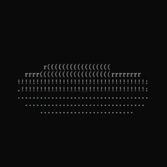

<p align="center">
    
</p>

A software 3D triangle rasterizer and math graphics calculator written from scratch in pure C. Parses and renderers .obj objects (must be triangulated) in ASCII to the terminal screen with Z-Buffering and specular lighting

REQUIREMENTS: Native Linux, macOS or any unix system like WSL2

### 1. Installation
Clone the repository to your local environment:
```bash
git clone https://github.com/Slashr2020/ascii-3d-renderer.git
```

### 2. Build and Execute

Navigate to the build/ folder and launch the app:

```bash
cmake -B build
cd build && cmake --build .

./graphics_app
```

### 2.1. Launch arguments 

To render your own .obj model, you need to specify the filename from the obj/ folder
Example:
```bash
./graphics_app suzanne.obj
```
